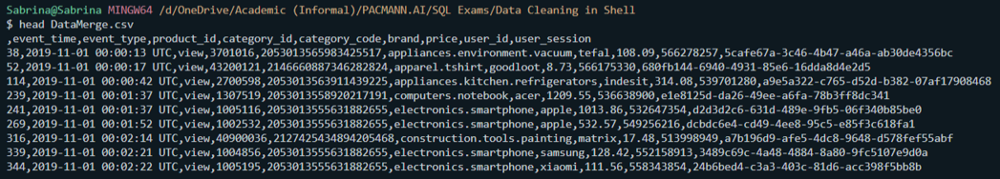

# **Data Cleaning in Shell**

> This project was developed as an Exam in the Shell Tooling Course at [Pacmann.AI Data Science Programm](https://pacmann.io/sekolah-data-science).

## Data

You may download the data traffic ecommerce [here](https://drive.google.com/file/d/1rKkUQU-sXIDka3rVNBahp6q3wDhrPY-1/view)

The data consists of:

1. 2019-Oct-sample    
2. 2019-Nov-sample     

## Rubics

1. Merge both data into one file.
2. Select relevant columns for product analysis.
3. filter the rows to get only purchasing activity.
4. Split the category code column into  product category data and product name columns

## Dependecies

1. Bash
2. Csvkit
3. Git

## Background

You are asked to clean up the e-commerce traffic data where you work. The data provided is data for October and November 2019. Your boss wants to analyze the products sold. You are asked to clear the data and leave the relevant data.

## Code & Preview

1. Append both data into one file

    `awk '(NR == 1) || (FNR > 1)' *.csv > DataMerge.csv`
    
     

2. select designated columns

    `awk -F "," '{print $2 "," $3 "," $4 "," $5 "," $7 "," $8 "," $6;}' DataMerge.csv > SelectedColumn.csv`
    
     

3. Filter event_type = "purchase"

    `awk -F "," 'NR == 1; $2 == "purchase" {print }' SelectedColumn.csv > ColumnFiltered.csv`
    
     

4. Split Category Code column into category and product name columns

   - Create parent file
   
      `awk -F "," '{print $1 "," $2 "," $3 "," $4 "," $5 "," $6;}' ColumnFiltered.csv > parentfile.csv`
      
       

   - Extract the category column from category code column:
   
      `awk -F "," '{print $7;}' ColumnFiltered.csv | cut -d "." -f -1 | awk -F"," 'BEGIN { OFS = "," } NR==1{$1="category";print; next}{print}' > category.csv` 
      
       

   - Extract the product name column  from category code column:
   
      `awk -F "," '{print $7;}' ColumnFiltered.csv | cut -d "." -f 2- | awk -F"," 'BEGIN { OFS = "," } NR==1{$1="product name";print; next}{print}' > productnames.csv`
      
       

   - Merge category column & product name column
   
      `paste -d , category.csv productnames.csv > childfile.csv`
      
       

   - Merge parentfile.csv & childfile.csv
   
      `paste -d , parentfile.csv childfile.csv > data_clean.csv`
      
       

   - validate the data
   
      `grep electronics data_clean.csv | grep smartphone| awk -F ',' '{print $5}'| sort | uniq -c | sort -nr`
      
       

## Authors

[Sabrina Pribadi](https://www.linkedin.com/in/sabrinapribadi/)

